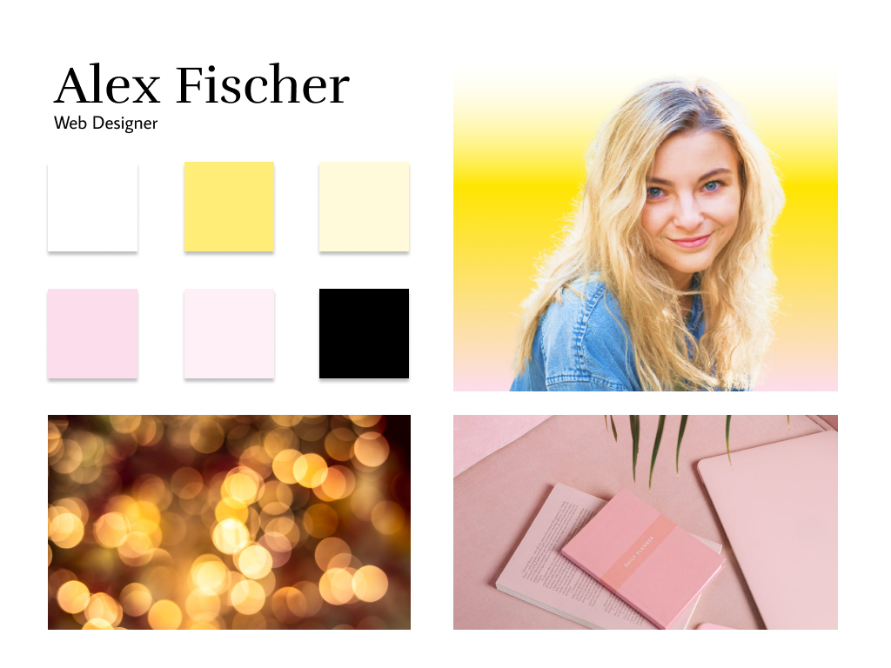

# Alex Fischer Portfolio
Alex wants a single static website that shows her image, work and contact page. She wants it minimalist and simple portfolio page. 

Current Version [here]()

Mobile and Tablet version in the works.

# Table of Contents
- [First Version](#first-version-v1)
- [Moodboard](#moodboard)
- [Final Version](#the-final-version)
- [Built With](#built-with)
- [Authors](#authors)
- [Next Steps](#next-steps)

# First Version
The first version had simple background with a sprinkle of pink and yellow

# Moodboard 
Alex is a huge fan of pink and yellow. She is a web designer.

# The final version

# Built With
- HTML
- CSS

# Authors
- Web Designer: Me
- FrontEnd Developer: Me

# Next Steps
It would be nice to 
- add functionality to the form 
- add a button to return to the top in the footer.
- create pages for each work 